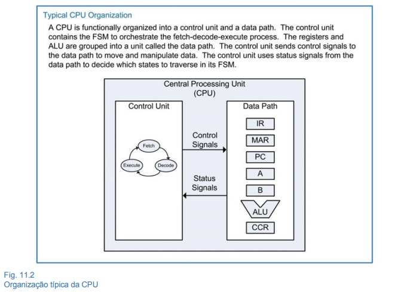
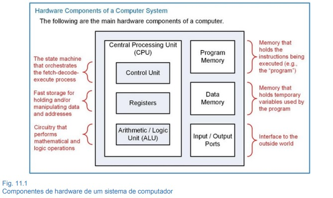
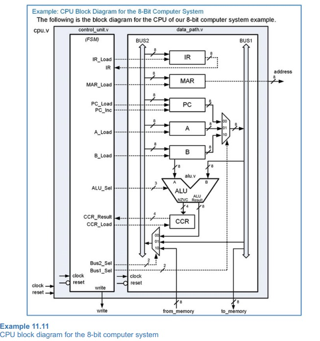

# 8-bit CPU and Assembler Toolchain

A comprehensive academic project developed for the Microprocessors course at the Federal University of Ceará (UFC). This repository contains the complete ecosystem for a custom-designed 8-bit CPU, including its Verilog hardware design, a dedicated C++ compiler for its custom assembly language, and a verification testbench.

---

## 🏛️ CPU Architecture

The CPU's architecture is based on a classic Von Neumann design, featuring a distinct Control Unit and Data Path.


_**Fig. 1:** Typical CPU Organization, showing the interaction between the Control Unit and the Data Path._

The Control Unit contains the Finite State Machine (FSM) that orchestrates the fetch-decode-execute cycle, while the Data Path holds the registers and the Arithmetic Logic Unit (ALU).


_**Fig. 2:** Hardware Components of the System._

The detailed block diagram below illustrates the interaction between the main modules, showing the registers, buses, and control signals.


_**Fig. 3:** Detailed block diagram of the 8-bit CPU._

---

## 📝 Project Scorecard & Features

This project was developed based on a set of academic requirements. The following checklist details the features implemented.

### ✅ Core Hardware Requirements
- **Word Size:** 8-bit datapath and registers.
- **Registers:** 3 general-purpose registers (A, B, C) and a Flag Register (CCR).
- **Instruction Set:**
  - **Arithmetic:** `ADD`, `SUB`, `MUL`, `DIV`, `MOD`
  - **Relational:** `COMP`
  - **Logical:** `AND`, `OR`, `NOT`, `XOR`
  - **Data Transfer:** Implemented via operand fetching from memory addresses.
- **Control Flow:** `JMP` (unconditional jump) and `HALT` instructions are fully functional.

### ✅ Compiler Features
- **Comment Removal:** Ignores all content after a `;`.
- **Semantic Analysis:** Recognizes a fixed set of mnemonics and reports errors for undefined commands.
- **Syntactic Analysis:** Validates the number of arguments for each instruction and reports errors if they don't match.

### ✅ Extra Implemented Features
- **Extended Arithmetic:** `INC`, `DEC`
- **Extended Logical:** `NAND`, `NOR`, `XNOR`

---

## 🛠️ Toolchain & ISA

The project includes a custom toolchain to write and run programs on the CPU.

### Custom Assembler
A command-line assembler (`compiler/compiler.cpp`) was developed in C++ to translate human-readable assembly files (`.asm`) into the 8-bit machine code (`.bin`) that the processor executes.

### Instruction Set Architecture (ISA)
The custom ISA includes 16 instructions, which are fully implemented in the processor's hardware:

| Mnemonic | Opcode   | Arguments | Description                |
|:---------|:---------|:----------|:---------------------------|
| `INC`    | 00000001 | 1         | Increment                  |
| `DEC`    | 00000010 | 1         | Decrement                  |
| `NOT`    | 00000011 | 1         | Bitwise NOT                |
| `JMP`    | 00000100 | 1         | Unconditional jump         |
| `ADD`    | 00010000 | 2         | Addition                   |
| `SUB`    | 00100000 | 2         | Subtraction                |
| `MUL`    | 00110000 | 2         | Multiplication             |
| `DIV`    | 01000000 | 2         | Division                   |
| `MOD`    | 01010000 | 2         | Modulo (remainder)         |
| `AND`    | 01100000 | 2         | Bitwise AND                |
| `OR`     | 01110000 | 2         | Bitwise OR                 |
| `XOR`    | 10000000 | 2         | Bitwise XOR                |
| `NAND`   | 10010000 | 2         | Bitwise NAND               |
| `NOR`    | 10100000 | 2         | Bitwise NOR                |
| `XNOR`   | 10110000 | 2         | Bitwise XNOR               |
| `COMP`   | 11000000 | 2         | Compare two values         |

---

## 🚀 How to Use

### 1. Compile the Assembler
Navigate to the compiler directory and use the Makefile.
```bash
cd compiler
make
```

### 2. Assemble a Program
Use the compiled assembler to generate a binary file. The output must be named `file.bin` and placed in `src/` for the simulation to find it.
```bash
# From the 'compiler' directory:
./compiler ../examples/feature_showcase.asm ../src/file.bin
```

### 3. Run the Simulation
Use a Verilog simulator (like Icarus Verilog, ModelSim, or EDA Playground) to run the testbench located at `src/tb/processor_8bit_tb.v`.

---

## 🗺️ Future Work & Roadmap

The following features were not implemented in the current version and represent excellent opportunities for future expansion of the project. This list is based on the advanced requirements of the original academic project.

### ⚫️ Control Flow and Memory
- [ ] **Conditional Branching:** Implement conditional jump instructions (e.g., `JZ` - Jump if Zero, `JNZ` - Jump if Not Zero) based on the ALU's flag register.
- [ ] **Stack and Function Calls:** Implement a stack pointer, a memory stack, and `PUSH`/`POP`/`CALL`/`RET` instructions.

### ⚫️ ISA Expansion
- [ ] **Bit Manipulation:** Add dedicated bit shifting and rotation instructions (`SHL`, `SHR`, `ROL`, `ROR`).
- [ ] **I/O Operations:** Implement `IN` and `OUT` instructions to communicate with external peripherals mapped to memory.

### ⚫️ Architectural Enhancements
- [ ] **Interrupt Handling:** Develop a basic interrupt controller and an interrupt vector table to handle external events (`INT` instruction).
- [ ] **Pipelining:** Introduce a multi-stage pipeline (e.g., Fetch, Decode, Execute) to improve instruction throughput.

---

## 👥 Authors & Acknowledgments
This project was developed as a collaborative effort for the Microprocessors course at the Federal University of Ceará.
- Alisson Jaime Sales Barros
- José Ferreira Lessa
- Matheus Rocha Gomes da Silva
- Thiago Siqueira de Sousa

